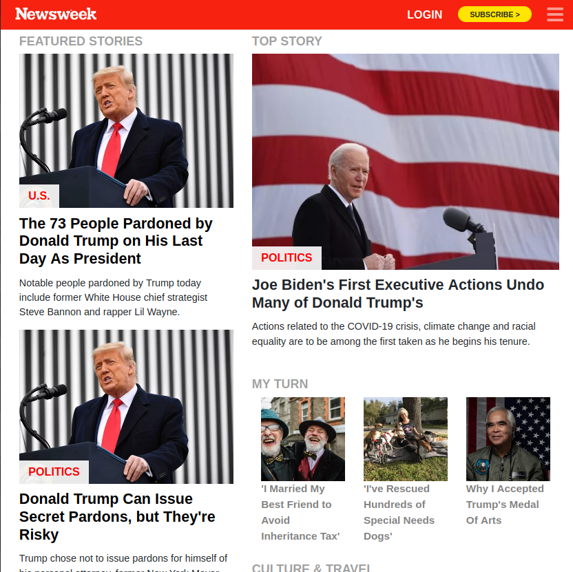

# News week clone project



Clone of the Newsweek website page using bootstrap.

## Built With

- HTML5
- CSS
- Bootstrap
- Media querry


## Live Demo

HEAD TO
[Newsweek](https://denisdiaconu.github.io/Newsweek-clone/)
=======


### Prerequisites

-  Knowledge about HTML and CSS
-  HTML Semantic elements
-  CSS flex property
-- CSS grid property
-  Bootstrap
-  Media querry


## Authors

👤 **Denis Andrei Diaconu**

- GitHub: [@DenisDiaconu](https://github.com/denisdiaconu)
- Twitter: [@DenisAndreiDia1](https://twitter.com/DenisAndreiDia1)
- LinkedIn: [Denis Diaconu](https://www.linkedin.com/in/denis-diaconu-1394091b7/)


## Getting Started

To get a local copy up and running follow these simple example steps.
- Clone this repository with git clone```https://github.com/denisdiaconu/TNW-Project.git`` using your terminal or command line.
- Change to the project directory by entering : <br>
```cd NYTproject``` in the terminal .

## 🤝 Contributing

Contributions, issues, and feature requests are welcome!

Feel free to check the [issues page](issues/).

## Show your support

Give a ⭐️ if you like this project!

## Acknowledgments

- Hat tip to anyone whose code was used
- Inspiration
- etc

## 📝 License

This project is [MIT](https://choosealicense.com/licenses/mit/) licensed.
